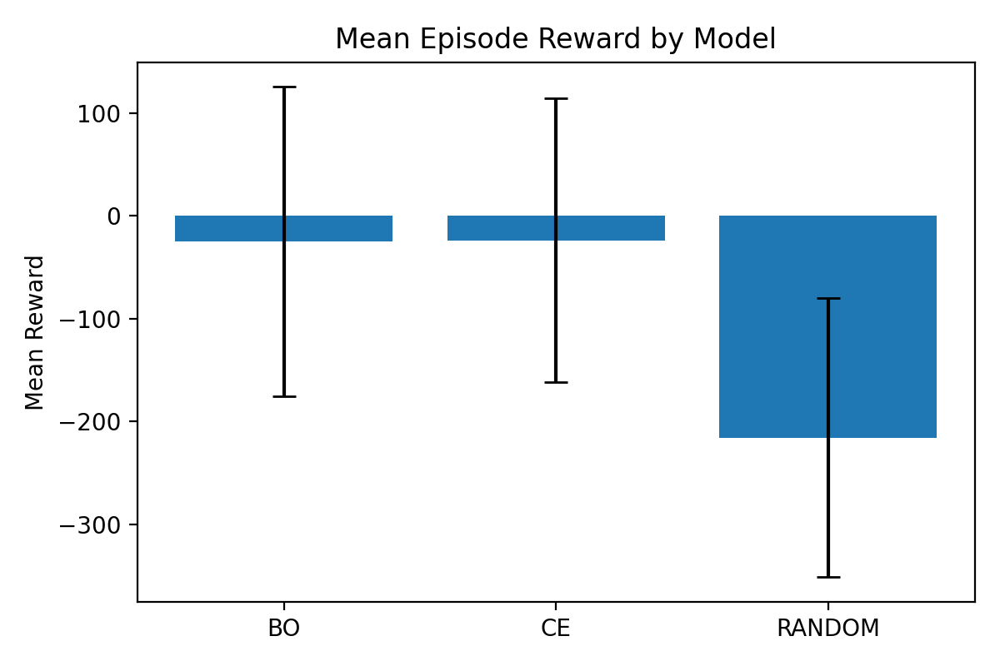
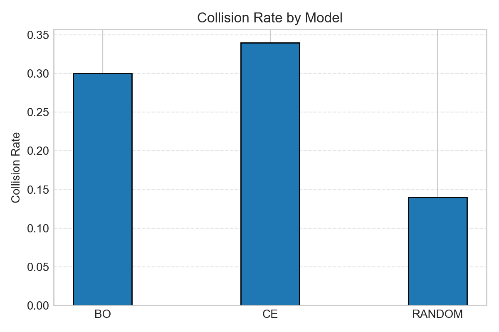
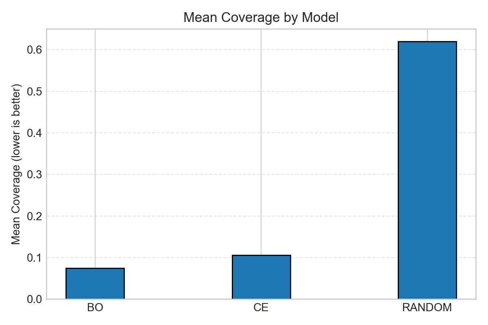
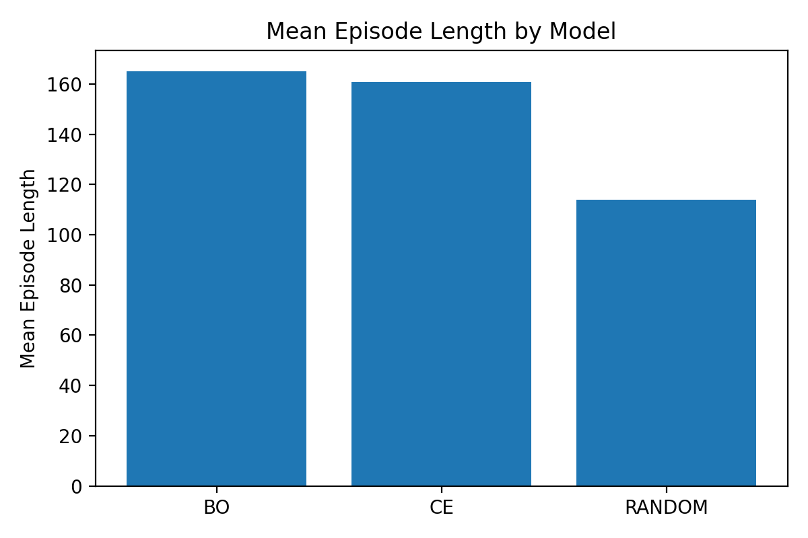

# FM-Metadrive

## Scenario Description

We use a **driving scenario in Scenic + MetaDrive on the Town01 map**.  
Each episode generates a new scene with randomized traffic and initial conditions.

### Environment

- Urban road network with multiple lanes and intersections  
- Semantic camera observations for perception  
- Road lanes and centerlines are known from the map

### Initial State

At the beginning of each episode:

- Ego vehicle is spawned on a **randomly selected lane**
- Initial **position is sampled along the lane centerline**
- Initial **heading is perturbed** by ±0.25 rad relative to the lane direction
- A **lead vehicle** is spawned 8–20 meters ahead

### Other Vehicles

Additional cars are spawned with:

- `DriveAvoidingCollisions` behavior

They form:

- realistic background traffic  
- potential obstacles  
- interactions at intersections

### Objective of the Ego Vehicle

The ego agent must:

- stay on the road  
- avoid collisions  
- maintain forward progress  

Reward combines:

- lane deviation (cross-track error)
- orientation alignment
- speed reward
- progress per step

Penalties for:

- leaving the road
- collisions
- early termination

---

## Training Strategies

We compare three sampling strategies.  
All models use PPO; only how we **sample scenarios** differs.

### Baseline: Random Sampling

- Scenic samples scenes uniformly at random
- No training feedback is used

This gives **broad coverage**, but many scenes are easy and uninformative.

---

### Cross-Entropy (CE) Sampler

- Uses **feedback from training episodes**
- Updates a probability distribution over scene parameters
- Gradually shifts sampling toward **hard scenes**

Training schedule:

- Episodes 1–50: random
- After 50: feedback → CE sampler

---

### Bayesian Optimization (BO) Sampler

- Treats difficulty as a **black-box function**
- Uses a Gaussian Process to model:
  - expected difficulty
  - uncertainty

BO proposes scenes that are:

- **likely to be difficult**
- **uncertain**

This results in **targeted exploration** and strong generalization.

---

### Feedback Definition

Both CE and BO minimize a single scalar:

```feedback = -( collision + early termination + negative reward + low coverage )```


Higher difficulty → more negative feedback → more sampling weight.

---

## Results

We trained three models:

- Random
- CE
- BO

We evaluated each for **50 episodes** on the **same fixed test scenes**.

### Summary Metrics (Test)

| Method  | Mean Reward (↑) | Reward Std | Collision Rate (↓) | Mean Coverage (↓) | Mean Episode Length (↑) |
|--------|----------------:|-----------:|-------------------:|------------------:|------------------------:|
| **BO** | **-24.99**       | 150.79     | **0.30**           | **0.07476**       | **165.16**              |
| **CE** | -23.63          | 138.42     | 0.34               | 0.10604           | 160.72                  |
| RANDOM | -215.76         | 135.64     | **0.14**           | **0.61951**       | 113.96                  |

---

## Plots

### Reward



### Collision Rate



### Coverage (Lane Deviation)



### Episode Length



---

## Why CE and BO Have More Collisions

Random sampling produces mostly **easy scenes**, so collisions are rare.

CE and BO **intentionally search for difficult scenarios**:

- dense traffic  
- sharp curves  
- misaligned starting poses  
- close headway

More difficult scenes → more collision opportunities.

This behavior is common in:

- curriculum learning
- adversarial sampling
- stress testing

> Higher collision rate does **not** mean worse policy.  
> It means the agent is being evaluated in **harder situations**.

---

## Conclusion

> **BO produced the most robust policy**
>
> - best lane following (lowest coverage)  
> - longest episodes  
> - good reward  
> - reasonable collision rate  

Even though CE/BO crash more than Random, they solve **much harder scenes**.

---

## Future Work

To further improve:

- tune feedback weighting
- longer training than 250 episodes
- hybrid sampler (CE → BO)
- explicit safety shaping:
  - stronger penalties for lane departure and collision

---


